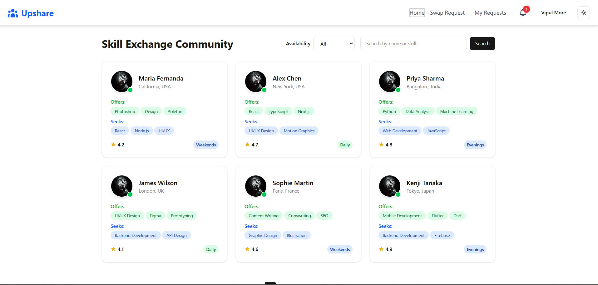
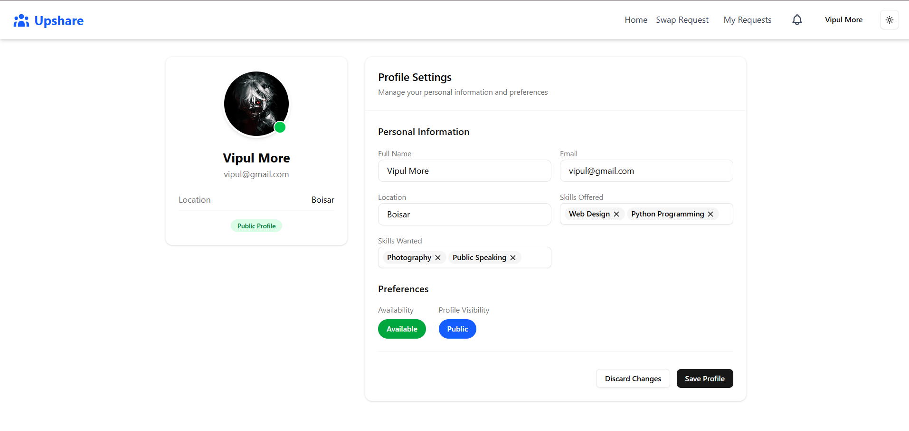
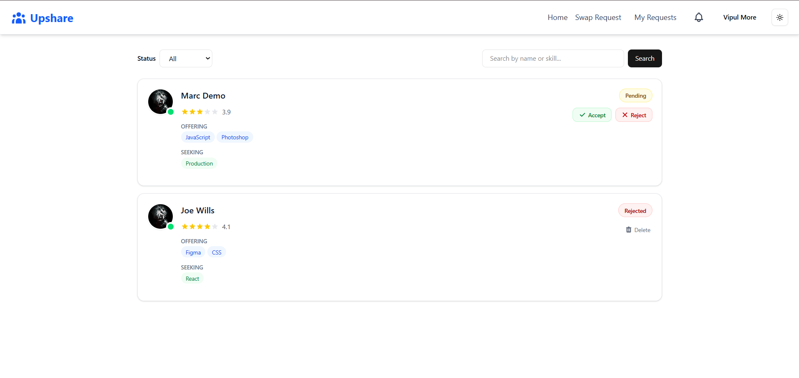

# Upshare - Skill Swap Platform

Upshare is a hackathon project for a skill-swap platform where people uplift each other by sharing skills. The goal is to connect learners and mentors for short, focused exchanges with lightweight coordination.

## Key Features

- Skill swap listings with clear skill offers and requests
- Simple discovery flow focused on quick matching
- Lightweight UI built for iteration and demo speed
- Planned backend support for user accounts and media (Cloudinary)

## Tech Stack & Dependencies

**Frontend**

- React 19
- TypeScript 5.8
- Vite 7
- ESLint 9

**Backend (scaffolding present)**

- Python (Django-style setup inferred from .env keys and .gitignore)
- Cloudinary environment variables in backend .env

## Prerequisites

- Node.js 18+ and npm (for the frontend)
- Python 3.10+ (only if you add backend code)

## Installation

### Frontend

```bash
cd frontend
npm install
```

### Backend

The backend folder contains environment variables and Django-style ignores, but no application code or dependency manifest was found in this repository. Add your backend app and dependencies before installing.

## Usage

### Run the frontend

```bash
cd frontend
npm run dev
```

### Build the frontend

```bash
cd frontend
npm run build
```


## UI Screenshots

Use these placeholders to drop in screenshots or mockups. Screens are based on frontend routes and components.

**Home / Skill Exchange Feed**

<div align="center">

</div>

**My Profile / Settings**

<div align="center">

</div>

**Swap Requests**

<div align="center">

</div>

**Admin Dashboard**

<div align="center">

</div>


## Contributing

1. Fork the repository.
2. Create a feature branch: `git checkout -b feat/your-feature`.
3. Commit your changes with clear messages.
4. Open a pull request describing the change and why it is needed.
